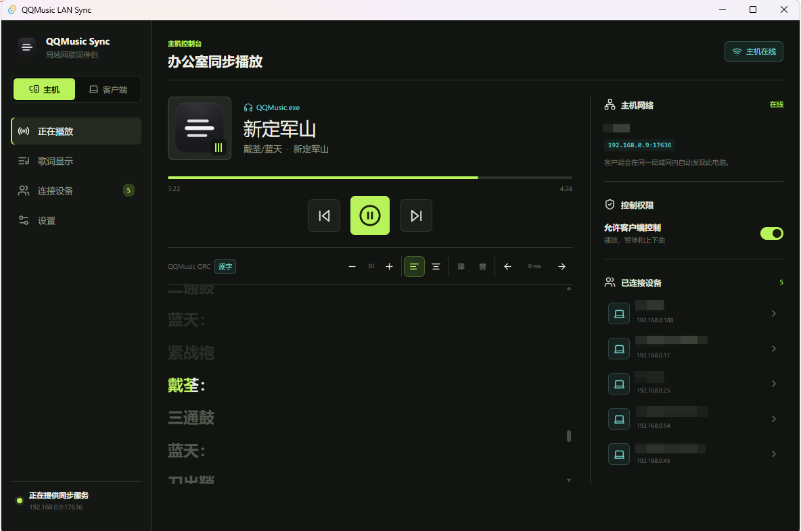
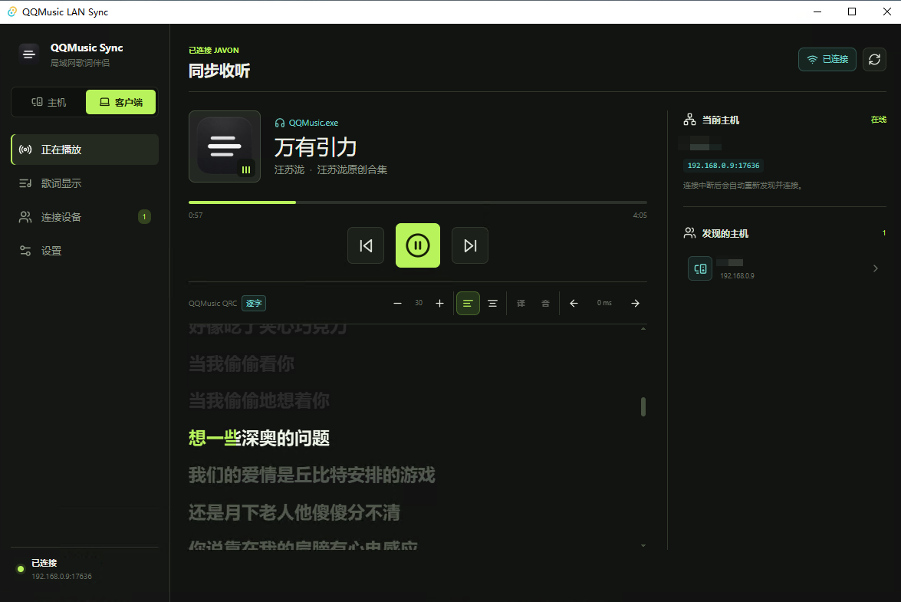
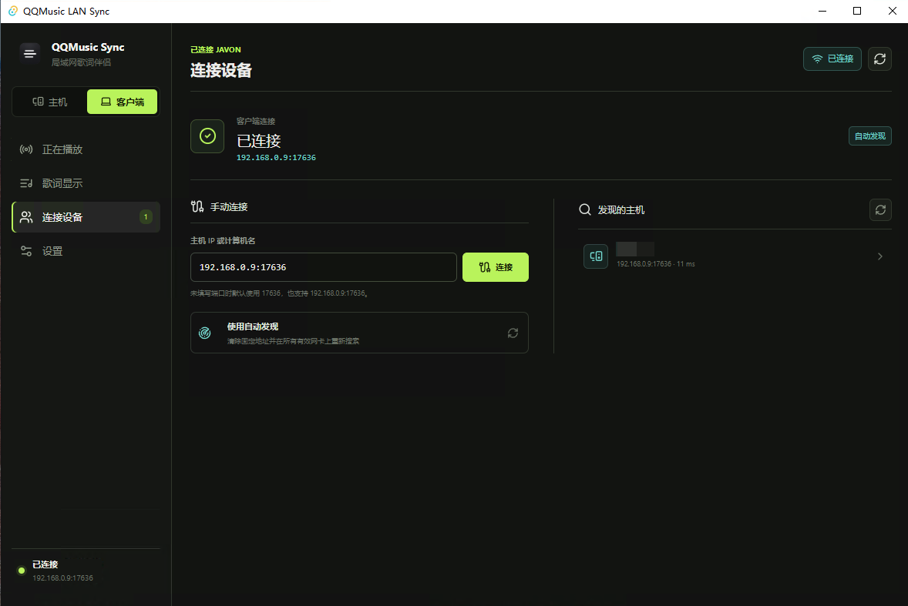
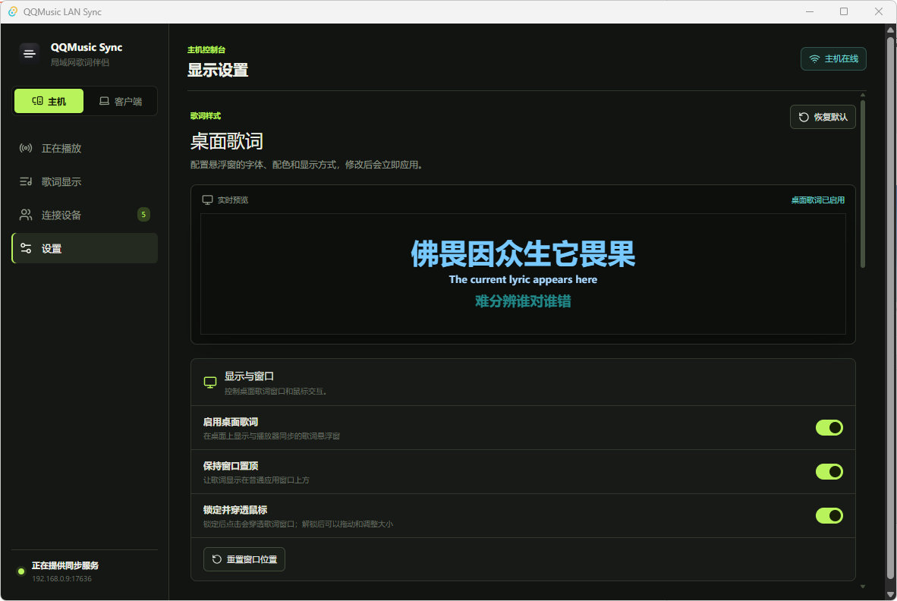
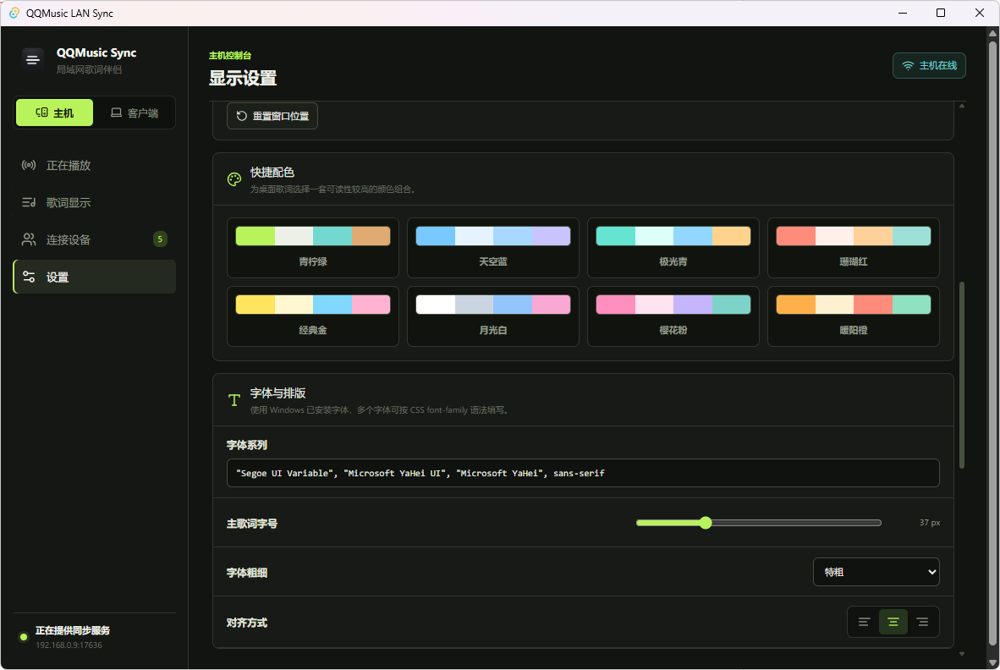
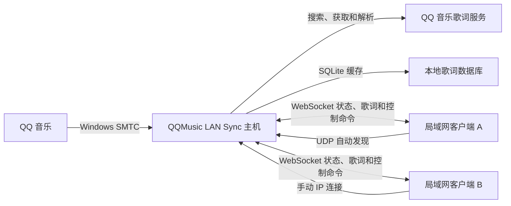

# QQMusic LAN Sync

QQMusic LAN Sync 是一个面向 Windows 的局域网音乐同步工具。运行 QQ 音乐的电脑作为主机，办公室或家庭局域网中的其他电脑运行同一个客户端，即可同步查看当前歌曲、播放进度和逐行/逐字歌词，并在获得主机授权后控制播放、暂停、上一曲和下一曲。

项目使用 Tauri 2 构建原生 Windows 桌面应用，不依赖浏览器页面、二维码或云端中转服务。一个安装包同时支持主机和客户端模式。

## 界面预览

### 主机控制台

主机端读取 QQ 音乐状态并向局域网客户端同步播放进度、逐字歌词和控制权限。



### 客户端同步与连接

| 客户端同步播放 | 自动发现与手动连接 |
| --- | --- |
|  |  |

### 桌面歌词设置

| 桌面歌词实时预览 | 配色、字体与排版 |
| --- | --- |
|  |  |

## 主要功能

- 主机/客户端角色可在运行时切换
- 通过 Windows SMTC 读取 QQ 音乐的歌曲信息、播放状态、进度和控制能力
- 同步歌曲标题、歌手、专辑、封面、播放进度与歌词
- 支持 QQ 音乐 QRC 逐字歌词、LRC 逐行歌词、翻译和罗马音
- 自动发现同一局域网内的主机
- 支持通过 IP、计算机名或自定义端口手动连接
- 断线后自动发现并重新连接
- 可由主机统一开启或关闭客户端播放控制权限
- 独立桌面歌词窗口，默认透明背景、无边框、置顶且不占用任务栏
- 桌面歌词支持锁定穿透、拖动、位置记忆、字体、字号、字重、对齐、颜色和背景样式设置
- 系统托盘支持显示主窗口、显示/隐藏或锁定桌面歌词，以及播放控制
- 最小化或关闭主窗口后驻留系统托盘
- 连接失败时区分发现超时、端口拒绝、网络不可达、防火墙或安全软件、协议不兼容等原因

## 使用方式

### 主机端

1. 在播放音乐的 Windows 电脑上启动 QQ 音乐和 QQMusic LAN Sync。
2. 将运行模式设置为“主机”。软件首次启动时默认进入主机模式。
3. 确认界面显示“主机在线”和本机局域网地址。
4. 根据需要开启“允许客户端控制”。
5. Windows 防火墙弹出网络访问提示时，允许应用访问当前专用网络。

### 客户端

1. 在同一局域网内的另一台 Windows 电脑上启动 QQMusic LAN Sync。
2. 切换为“客户端”，等待软件自动发现并连接主机。
3. 如果自动发现受 VLAN、无线终端隔离或防火墙影响，可在“连接设备”中输入主机 IP，例如 `192.168.0.9`。
4. 未填写端口时默认使用 `17636`，也可以输入 `192.168.0.9:17636` 或 `ws://192.168.0.9:17636/ws`。

## 技术栈

| 层级 | 技术 | 用途 |
| --- | --- | --- |
| 桌面框架 | Tauri 2 | Windows 窗口、托盘、原生命令与安装包 |
| 前端 | React 19 + TypeScript | 主界面、歌词面板、连接管理与桌面歌词设置 |
| 构建工具 | Vite 8 + pnpm | 前端开发、类型检查和生产构建 |
| 样式 | SCSS + Tailwind CSS 4 | 应用界面和桌面歌词样式 |
| 图标 | Lucide React | 界面图标 |
| 后端 | Rust 2021 + Tokio | 播放器读取、歌词服务、网络同步与任务生命周期 |
| HTTP/WebSocket | Axum + tokio-tungstenite | 主机服务和客户端长连接 |
| Windows 媒体接口 | Windows Runtime `Media_Control` | 读取和控制系统媒体会话 |
| 歌词请求 | Reqwest | 搜索并获取 QQ 音乐歌词 |
| 歌词解析 | Regex + lyrics-crypto | LRC/QRC 解析与 QRC 解密 |
| 本地存储 | SQLite / rusqlite | 按歌曲缓存解析后的歌词 |

## 系统架构



### 播放器状态

Rust 后端通过 Windows `GlobalSystemMediaTransportControlsSessionManager` 获取当前系统媒体会话。主机每秒生成一次播放快照，包括：

- 歌曲稳定标识
- 标题、歌手、专辑与封面
- 当前进度和总时长
- 播放/暂停状态
- 上一曲、下一曲、播放暂停等能力

播放控制同样通过 Windows SMTC 执行，因此 QQ 音乐必须正常向 Windows 提供媒体会话。当前实现以系统当前媒体会话为准，如果其他媒体应用抢占系统会话，读取到的来源可能发生变化。

### 歌词获取与缓存

主机根据 SMTC 返回的歌名、歌手和时长搜索 QQ 音乐曲库，并对候选歌曲进行相似度排序。歌词获取按以下顺序尝试：

1. QQ 音乐旧版歌词接口，获取并解密 QRC 原文、翻译和罗马音。
2. QRC 不可用时回退到新版简单歌词接口获取 LRC。
3. 解析时间轴、逐字时间信息和内嵌偏移量。
4. 将结构化歌词保存到本机 SQLite 数据库，后续播放同一歌曲时优先读取缓存。

歌词只由主机获取一次，再通过局域网同步给所有客户端。客户端无需分别请求 QQ 音乐歌词服务。

### 局域网自动发现

客户端使用 UDP 广播查找主机。为了兼容多网卡、虚拟网卡和部分路由环境，会同时发送：

- 全局广播地址 `255.255.255.255`
- 各有效 IPv4 网卡根据 IP 和子网掩码计算出的定向广播地址
- 共 3 轮广播，每轮间隔约 450 ms
- 最长等待响应 3 秒

自动发现失败并不代表 TCP 同步不可用。只要客户端能访问主机的 `17636` 端口，就可以通过主机 IPv4 地址手动连接。

### 状态同步协议

主机提供 Axum WebSocket 服务，客户端连接 `/ws` 后交换 JSON 消息。当前协议版本为 `1`。

主机发送：

- 完整运行状态与播放快照
- 歌词文档
- 播放控制执行结果
- 用于校正客户端时间差的 Pong

客户端发送：

- 客户端名称
- 播放、暂停、上一曲和下一曲命令
- 时间同步 Ping

客户端每 2 秒发送一次 Ping。连接中断后，自动发现模式约 700 ms 后开始重新查找，固定地址模式约 3 秒后重试。

## 网络端口

| 协议 | 端口 | 方向 | 用途 |
| --- | --- | --- | --- |
| UDP | `17635` | 客户端到主机 | 自动发现请求与响应 |
| TCP | `17636` | 客户端到主机 | WebSocket 状态同步和播放控制 |

主机还提供 `http://<主机IP>:17636/health` 健康检查，正常响应内容为 `ok`。

### Windows 防火墙排查

客户端能 ping 通主机但无法连接时，优先在客户端 PowerShell 中检查 TCP 端口：

```powershell
Test-NetConnection 192.168.0.9 -Port 17636
```

如果 `TcpTestSucceeded` 为 `False`：

- 确认主机软件处于主机模式并显示在线。
- 确认主机正在监听 `17636`。
- 检查 Windows 防火墙、杀毒软件和公司终端安全策略。
- 检查无线 AP 客户端隔离、不同 VLAN 或公司网络 ACL。
- 断开可能改变路由的 VPN，或检查虚拟网卡优先级。

## 安全说明

当前同步协议用于可信局域网，未实现用户认证、设备配对或 TLS 加密。开启“允许客户端控制”后，能够连接主机端口的局域网设备可以发送播放控制命令。

不要将 TCP `17636` 或 UDP `17635` 映射到公网，也不要在不受信任的公共 Wi-Fi 中开启客户端控制。后续版本可考虑加入设备授权、会话密钥和加密传输。

## 桌面歌词

桌面歌词使用独立的透明 Tauri Webview 窗口实现：

- 默认背景透明度为 `0%`，不显示系统边框和阴影。
- 窗口可置顶、缩放和拖动，锁定后启用鼠标穿透。
- 位置保存在 Tauri 应用数据目录，重启后自动恢复；如果上次位置不在当前显示器范围内，则回到屏幕中央。
- 字体、字号、字重、对齐、活跃/未播放歌词颜色、翻译/罗马音颜色、背景透明度和模糊度保存在 Webview Local Storage。
- 内置青柠绿、天空蓝、极光青、珊瑚红、经典金、月光白、樱花粉和暖阳橙 8 套配色。

## 开发环境

### 前置要求

- Windows 10/11 x64
- QQ 音乐 Windows 客户端
- Node.js `22.23.1`
- pnpm `10.15.1`
- Rust `1.97.1`，最低兼容版本由 Cargo 声明为 `1.85`
- Visual Studio 2022 Build Tools，包含“使用 C++ 的桌面开发”
- Windows 10/11 SDK
- Microsoft Edge WebView2 Runtime

推荐使用 nvm-windows 切换 Node.js：

```powershell
nvm install 22.23.1
nvm use 22.23.1
corepack enable
corepack prepare pnpm@10.15.1 --activate
```

项目的 `.cargo/config.toml` 默认使用 rsproxy.cn 的 crates.io 稀疏索引，以改善部分网络环境下的 Rust 依赖下载速度。

### 安装依赖

```powershell
git clone https://github.com/a312354805/QQMusic-LAN-Sync.git
cd QQMusic-LAN-Sync
pnpm install
```

### 运行开发版本

完整桌面功能必须通过 Tauri 启动：

```powershell
pnpm tauri dev
```

只运行前端预览可以使用：

```powershell
pnpm dev
```

浏览器模式使用模拟运行状态，无法访问 Windows SMTC、系统托盘和原生桌面歌词窗口。

### 检查与测试

```powershell
pnpm lint
pnpm build
cd src-tauri
cargo fmt --all -- --check
cargo check
cargo test
```

Rust 测试包含歌词解析、客户端地址解析、网络错误分类、定向广播地址计算和 Windows 媒体状态缓存逻辑。在线 QQ 音乐歌词接口测试默认忽略，避免普通测试依赖外部服务。

### 构建安装包

```powershell
pnpm tauri build --bundles nsis
```

Windows NSIS 安装包输出到：

```text
src-tauri/target/release/bundle/nsis/
```

## 项目结构

```text
qqmusic-lan-sync/
├─ src/                         React 前端
│  ├─ components/              歌词、连接管理和桌面歌词组件
│  ├─ hooks/                   Tauri 事件与设置状态 Hooks
│  └─ shared/                  前后端类型、命令封装和共享配置
├─ src-tauri/                   Rust/Tauri 后端
│  ├─ src/lyrics/              QQ 音乐歌词获取、解密与解析
│  ├─ src/network/             UDP 发现和 WebSocket 主机/客户端
│  ├─ src/player/              Windows SMTC 读取与播放控制
│  ├─ src/runtime.rs           主机/客户端任务生命周期
│  ├─ src/storage.rs           SQLite 歌词缓存
│  └─ src/commands.rs          Tauri 命令和桌面歌词窗口管理
├─ public/                      静态资源
├─ package.json                前端依赖和脚本
└─ rust-toolchain.toml          Rust 工具链版本
```

## 当前限制

- 仅支持 Windows；播放器读取依赖 Windows SMTC。
- 目前没有账号、设备认证和传输加密，仅适用于可信局域网。
- 自动发现依赖 UDP 广播，可能被 VLAN、AP 隔离或安全策略阻止。
- 歌词搜索依赖 QQ 音乐公开接口的可用性和返回格式，接口发生变化时可能需要适配。
- SMTC 返回的歌曲元数据不完整时，歌词搜索准确率会下降。
- 客户端当前只同步和控制播放，不会在本机播放相同音频。

## 参考项目与许可

本项目在界面设计、歌词展示和歌词获取实现上参考了以下开源项目：

- [Lyrics Plus](https://github.com/afeibukaixin/Lyrics-Plus)：界面与歌词同步展示参考，MIT License。许可证副本见 [LICENSE.lyrics-plus](./LICENSE.lyrics-plus)。
- [163MusicLyrics](https://github.com/jitwxs/163MusicLyrics)：QQ 音乐歌词接口、QRC 解密和歌词解析思路参考，Apache License 2.0。许可证副本见 [LICENSE.163MusicLyrics](./LICENSE.163MusicLyrics)。

QQ 音乐名称及相关商标归其权利人所有。本项目是非官方局域网辅助工具，与腾讯或 QQ 音乐不存在隶属或授权关系。
